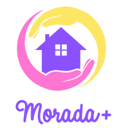

# Morada Mais

<p align="center">  </p

Uma plataforma de aluguel compartilhado e de baixo custo, focada no público LGBTQIA+, criada para fornecer moradia digna e bem estar.

### Tecnologias usadas no do projeto

HTML, CSS, JavaScript, MySQL, PHP e Bootstrap.

### Código fonte

```
git clone https://github.com/roxreis/morada-mais
```

### Instalação do projeto

Para execução basta um servidor local, testado no WAMP e XAMP.

Criar banco de dados no MySQL com nome moradamais(existe um arquivo sql na pasta models/db).

### Funcionalidades

- [x] Página inicial.
- [x] Quem somos.
- [x] Contato.
- [x] Cadastro.
- [x] Login.
- [x] Login de administrador.
- [x] Envio de mensagem pelo footer e listagem da mesma na pagina admin.
- [x] Pagina do administrador com relatório de usuários e cadastro de novo admin.
- [x] Feed.
- [x] Chat.

### Link para o projeto.

http://moradamais.infinityfreeapp.com/


### Importante!

Para acessar a área restrita administrativa é necessario ter a senha de acesso:
Email = admin@admin
Senha = 123

Para logar como admin é necessario mudar o nivel de acesso na página de login 
